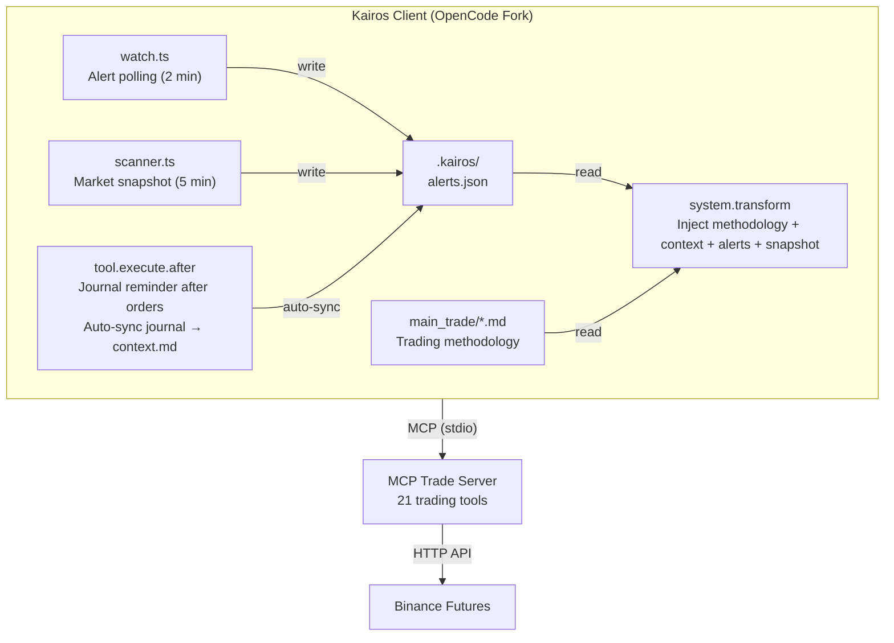

<p align="center">
  <h1>KAIROS</h1>
  <p>AI Subjective Trading Client — Price Action, Human-in-the-Loop</p>
</p>

<p align="center">
  <a href="README.md">English</a> |
  <a href="README.zh.md">简体中文</a>
</p>

---

Kairos is a fork of [OpenCode](https://github.com/anomalyco/opencode), repurposed as an AI-assisted subjective trading client.

It pairs with [MCP Trade Server](https://github.com/Ye-Yu-Mo/mcp_trade) (21 Binance futures trading tools) and comes with a built-in Price Action trading methodology. The AI analyzes, alerts, and enforces discipline. You decide and pull the trigger.

**Human-in-the-loop. Risk stays with you. The AI is your trading assistant, not a trading bot.**

### Why Kairos

| | Raw MCP | Kairos |
|------|---------|--------|
| Session memory | AI forgets trades between sessions | Auto-loads context, positions, alerts |
| Analysis method | Tell AI how to analyze every time | Built-in framework (1h structure → 15m levels → 5m signals) |
| Trading discipline | AI forgets to journal | Auto-reminder after order/OCO/cancel |
| Market monitoring | Manual market.watch calls | Scheduled scripts poll automatically |
| Setup | Manual MCP config + hand-written prompts | One-click install script |

### Install

```bash
git clone https://github.com/Ye-Yu-Mo/kairos.git
cd kairos
bash kairos-setup.sh
```

Global link the `kairos` command:

```bash
cd packages/opencode
bun link
```

Then start from any directory:

```bash
kairos
```

### Configure

### MCP Trade Server

Kairos depends on [MCP Trade Server](https://github.com/Ye-Yu-Mo/mcp_trade) for 21 trading tools:

- **Market**: scanner, klines, price, orderbook, ticker, watch, funding, OI
- **Account**: balance, positions
- **Orders**: place, OCO, cancel, modify stop, list, status
- **Trading**: journal, journal list, history, performance
- **Alerts**: set/list/remove, economic calendar

The two projects work best together. MCP Server provides the data pipeline. Kairos provides the analysis framework and discipline enforcement.

### Trading Methodology

Kairos ships with a complete Price Action framework (`main_trade/`):

- `analysis-framework.md` — Market analysis: 1h structure → 15m key levels → 5m entry signals
- `trade-plan-template.md` — Trade plan: entry, stop loss, take profit, position sizing
- `review-template.md` — Post-trade review: 5-category attribution (A/B/C/D/E) + rule compliance
- `SPEC.md` — Trading system specification

Methodology is customizable. The AI may suggest improvements based on experience, but you have the final say on all rule changes.

### Architecture



### Project Structure

```
kairos/
├── packages/opencode/          # OpenCode CLI (Fork)
│   └── plugins/kairos/        # Kairos plugin
│       ├── index.ts           # Entry (system.transform + tool.execute.after)
│       ├── context.ts         # System prompt builder
│       ├── hooks.ts           # Tool interceptors
│       └── sync.ts            # Context.md auto-sync
├── script/                    # Scheduler scripts
│   ├── watch.ts               # Alert polling (2 min)
│   ├── scanner.ts             # Market snapshot (5 min)
│   └── setup-cron.sh          # Launchd/cron installer
├── main_trade/                # Trading methodology
├── .kairos/                   # Runtime state (auto-generated)
│   ├── alerts.json            # Triggered alerts
│   ├── top20.json             # Top 20 market snapshot
│   ├── context.md             # AI trading context
│   └── positions.json         # Current positions
└── .opencode/opencode.jsonc   # OpenCode config
```

### Risk Warning

Kairos is an **assistive tool**, not an automated trading system. All trading decisions are your responsibility.

Cryptocurrency trading carries extreme risk. Only trade with funds you can afford to lose.

---

Built on [OpenCode](https://github.com/anomalyco/opencode). Thanks to the OpenCode team for their open-source work.

MCP Trade Server provides the trading infrastructure. Both projects are MIT licensed.
