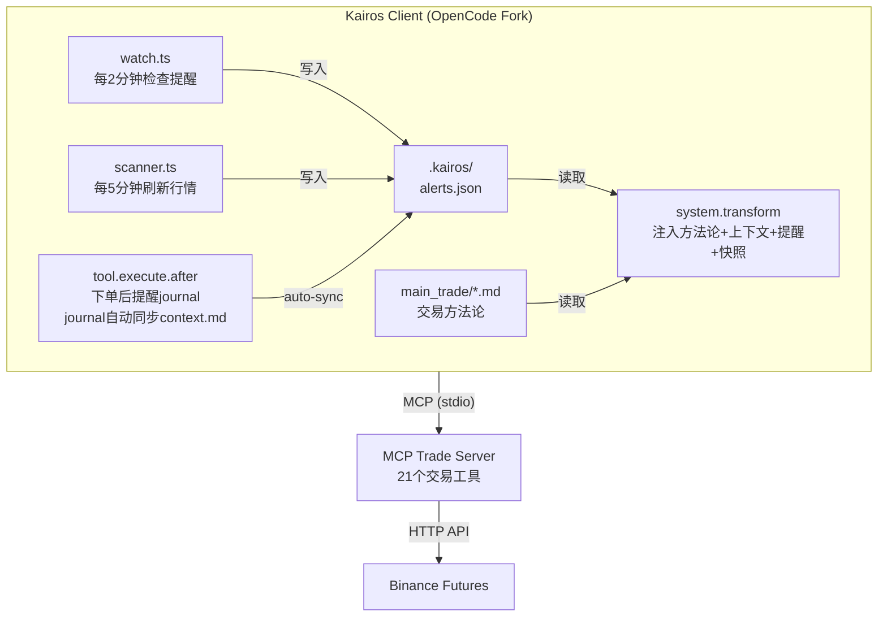

<p align="center">
  <h1>KAIROS</h1>
  <p>AI 主观交易客户端 —— 基于价格行为，人机协同</p>
</p>

<p align="center">
  <a href="README.md">English</a> |
  <a href="README.zh.md">简体中文</a>
</p>

---

Kairos 是 [OpenCode](https://github.com/anomalyco/opencode) 的 Fork，改造为一个 AI 辅助主观交易客户端。

它配套 [MCP Trade Server](https://github.com/Ye-Yu-Mo/mcp_trade)（21 个 Binance 合约交易工具），内置完整的价格行为（Price Action）交易方法论。AI 负责分析、提醒、追踪纪律；你负责做决定、扣扳机。

**人在回路，风险可控。AI 是交易助手，不是交易机器人。**

### 为什么用 Kairos

| | 直接调 MCP | 用 Kairos |
|------|-----------|-----------|
| 会话记忆 | 每次新对话，AI 不记得上次交易 | 自动加载上次上下文、持仓、提醒 |
| 分析方法论 | 每次手动告诉 AI 怎么分析行情 | 内置分析框架（1h 结构 → 15m 水平 → 5m 信号） |
| 交易纪律 | AI 容易忘记写 journal | 下单/OCO/撤单后自动强制提醒写日志 |
| 市场监控 | 需要手动调 market.watch | 定时脚本自动轮询，触发提醒自动通知 |
| 安装配置 | 手动配 MCP + 手写 prompt | 一键安装脚本，开箱即用 |

### 安装

```bash
# 一行安装
curl -fsSL https://raw.githubusercontent.com/Ye-Yu-Mo/kairos/main/install | bash

# 确保 ~/.bun/bin 在 PATH 中
echo 'export PATH="$HOME/.bun/bin:$PATH"' >> ~/.zshrc
source ~/.zshrc

# 启动
kairos
```

### 配置

### 配套 MCP Trade Server

Kairos 依赖 [MCP Trade Server](https://github.com/Ye-Yu-Mo/mcp_trade) 提供 21 个交易工具：

- **行情**：market.scanner、market.klines、market.price、market.orderbook、market.ticker、market.watch、market.funding、market.oi
- **账户**：account.balance、account.positions
- **订单**：order.place、order.oco、order.cancel、order.modify_stop、order.list、order.status
- **交易**：trade.journal、trade.journal_list、trade.history、trade.performance
- **提醒**：market.alerts、market.calendar

两个项目配合使用效率最高。MCP Server 提供数据管道，Kairos 提供分析框架和纪律约束。

### 交易方法论

Kairos 内置完整的价格行为交易框架（`main_trade/` 目录）：

- `analysis-framework.md` — 市场分析流程：1h 定结构 → 15m 找关键水平 → 5m 等入场信号
- `trade-plan-template.md` — 交易计划模板：入场、止损、止盈、仓位计算
- `review-template.md` — 复盘模板：五类归因（A/B/C/D/E）+ 规则遵守检查
- `SPEC.md` — 交易系统规范

方法论可根据个人风格修改。AI 会在交易中提出改进建议，但规则的最终修改权在你手里。

### 架构



### 项目结构

```
kairos/
├── packages/opencode/          # OpenCode CLI (Fork)
│   └── plugins/kairos/        # Kairos 插件
│       ├── index.ts           # 插件入口
│       ├── context.ts         # system prompt 构建
│       ├── hooks.ts           # 工具拦截
│       └── sync.ts            # context.md 同步
├── script/                    # 调度脚本
│   ├── watch.ts               # 提醒轮询
│   ├── scanner.ts             # 行情快照
│   └── setup-cron.sh          # 定时任务安装
├── main_trade/                # 交易方法论
├── .kairos/                   # 运行时状态
│   ├── alerts.json            # 触发提醒
│   ├── top20.json             # 市场快照 Top 20
│   ├── context.md             # 交易上下文
│   └── positions.json         # 当前持仓
└── .opencode/opencode.jsonc   # OpenCode 配置
```

### 风险提示

Kairos 是辅助工具，不是自动交易系统。所有交易决策由你负责。

加密货币交易风险极高，请只用你能承受损失的资金。

---

Kairos 基于 [OpenCode](https://github.com/anomalyco/opencode) 构建，感谢 OpenCode 团队的开源贡献。

MCP Trade Server 提供交易基础设施。两个项目均为 MIT 协议。
